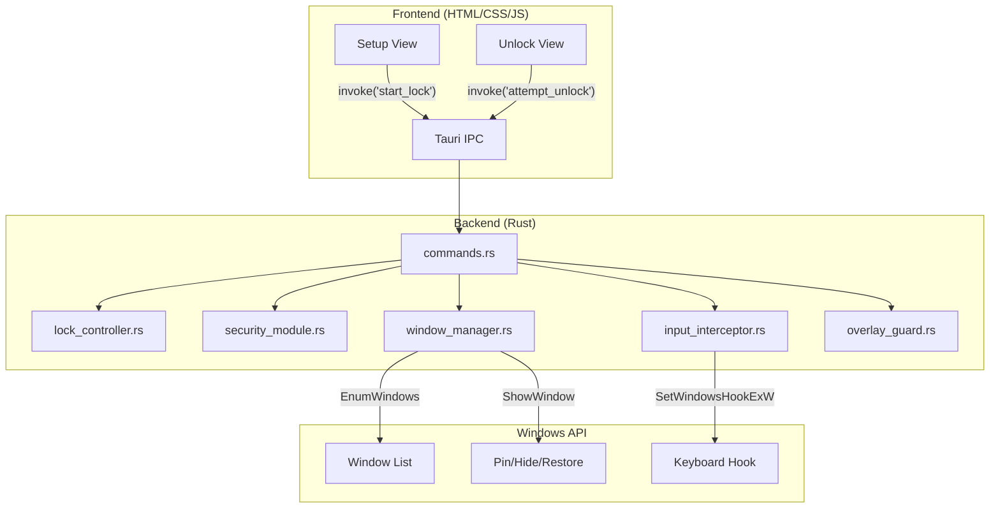

# 🔒 SecureLock

SecureLock is a locally-run, high-security desktop lockdown application built with Rust and Tauri. It allows you to select one or more running applications and aggressively locks your Windows OS into a kiosk-style mode, isolating you from everything else.

Perfect for presentations, lending your laptop to a friend, or keeping children locked safely into a specific video or game.

## 🛡️ Core Features

- **Multi-App Selection**: Freely select any combination of applications to keep running. SecureLock will forcefully ensure they remain maximized and on-screen.
- **Deep Windows OS Isolation**: While locked, SecureLock dives into Windows natively (`user32.dll`) to physically disable the Taskbar, hide your Desktop icons, and block Right-Click context menus.
- **Absolute Z-Index Enforcement**: A brute-force background loop consistently applies `HWND_TOPMOST` to the lock control widget, neutralizing "Show Desktop" behaviors.
- **Hardware Interception**: Low-level keyboard hooks (`SetWindowsHookExW`) are installed to entirely block system escape hatches like `Win+D`, `Alt+Tab`, `Alt+F4`, `Ctrl+Esc`, and `Ctrl+Shift+Esc`.
- **Argon2 Security**: The unlock mechanism relies on an Argon2-hashed setup PIN.

---

## ⚡ Download & Run Now (No setup required!)

If you just want to use the application without dealing with code, you can download the ready-to-use version directly from the repository!

1. Open the [downloads/](downloads/) folder in this repository.
2. Click on **`securelock_windows.exe`**.
3. Click the "Download raw file" button on the right side of the screen.
4. Double-click the file on your computer to instantly launch SecureLock!

---

## 👩‍💻 How To Use It

1. **Launch the App**: Open SecureLock. You will see a grid of all the windows you currently have open on your computer.
2. **Select Apps**: Click on the applications you want to isolate (e.g., Google Chrome and a specific video game).
3. **Set a PIN**: Create a secure 4-8 digit numeric PIN.
4. **Lock**: Click "Lock System". Every other window will instantly be hidden, your desktop icons and taskbar will be deactivated, and your chosen apps will be locked to the screen. 
5. **Unlock**: Click the "Unlock" button on the secure overlay widget in the top-right corner of your screen, re-enter your PIN, and your computer will immediately return to normal.

---

---

# 🏗️ Technical Architecture & Developer Walkthrough

For developers looking to compile the source code or understand the Rust backend, here is the technical breakdown of the OS locking mechanism.

## Project Structure

```text
securelock/
├── package.json                          # Node deps (Tauri CLI + API)
├── src/                                  # Frontend
│   ├── index.html                        # 3-view SPA (Setup / Locked / Unlock)
│   ├── styles/main.css                   # Design system (dark + glassmorphism)
│   └── js/
│       ├── app.js                        # View router + global state
│       ├── lock-setup.js                 # App selector + PIN config
│       ├── lock-active.js                # Locked overlay controller
│       └── unlock.js                     # Numpad PIN entry + validation
├── src-tauri/                            # Rust backend
│   ├── Cargo.toml                        # Rust deps
│   ├── tauri.conf.json                   # App config + CSP
│   └── src/
│       ├── main.rs                       # Entry point
│       ├── commands.rs                   # Tauri IPC bridge (4 commands)
│       ├── lock_controller.rs            # State machine + 4 unit tests
│       ├── security_module.rs            # argon2 hashing + rate limiter + 3 tests
│       ├── window_manager.rs             # Windows API (EnumWindows, ShowWindow)
│       ├── input_interceptor.rs          # Low-level keyboard hook (WH_KEYBOARD_LL)
│       └── overlay_guard.rs              # Fullscreen overlay via Tauri
```

## Architecture Map



## Key Security Design Decisions

| Decision | Rationale |
|----------|-----------|
| **argon2id for PIN hashing** | Memory-hard algorithm — resistant to GPU brute force |
| **Rate limiting (5 tries → 30s cooldown)** | Prevents brute force at the UI level |
| **Mutex released during hash computation** | Prevents thread starvation on expensive operations |
| **Background enforcement thread (500ms poll)** | Catches new windows and re-enforces focus continuously on chosen Windows |
| **Low-level keyboard hook** | Blocks shortcuts at OS level before they reach any app |
| **No PIN persistence (Phase 1)** | Reduces attack surface — PIN only lives in memory |
| **Dev escape feature flag** | `--features dev-escape` enables emergency Ctrl+Shift+Alt+Esc unlock |

## Lock Flow (End-to-End)

1. **User selects app** → Frontend calls `get_running_apps()` → Rust enumerates windows via `EnumWindows`
2. **User enters PIN** → Frontend calls `start_lock(hwnd, title, process, pin)`
3. **Backend engages lock**:
   - Hash PIN with argon2id
   - Transition state: Idle → Locked
   - Disable OS Interactions: Hide Desktop Icons, disable Right-Click Context Menus, and completely disable the Taskbar to block System Tray usage.
   - Minimize all other windows (`ShowWindow(SW_MINIMIZE)`)
   - Maximize ALL selected apps (`ShowWindow(SW_MAXIMIZE)`)
   - Install keyboard hook (`SetWindowsHookExW`)
   - Start enforcement thread (re-minimizes new windows every 500ms, keeps all selected apps visible)
   - Morph main setup window into a compact, draggable Top-Right widget (280x72)
4. **System is locked** — only the chosen apps (maximized) + widget are visible
5. **User clicks Unlock & enters PIN** → Window expands to show PIN pad, frontend calls `attempt_unlock(pin)`
   - Hash input, verify match
   - Remove keyboard hook
   - Stop enforcement loops
6. **Backend disengages lock**:
   - Verify PIN against stored argon2 hash
   - Stop enforcement thread + keyboard hook
   - Restore OS Interactions: Un-hide Desktop icons, re-enable Desktop right clicks, and re-enable Taskbar.
   - Restore all previously hidden windows (`ShowWindow(SW_RESTORE)`)
   - Morph widget back into full-size Setup window
   - Transition state: Locked → Idle

---

## 🛠️ How to Build & Compiling from Source

> [!IMPORTANT]
> **Prerequisites**: You need [Rust](https://rustup.rs/), [Node.js](https://nodejs.org/) ≥18, and [Tauri CLI v2](https://tauri.app/start/) installed.

### Step 1 — Install Dependencies

```bash
# Install Node dependencies
npm install

# Install Tauri CLI globally (if not already)
npm install -g @tauri-apps/cli
```

### Step 2 — Generate App Icons

```bash
# Use any 1024x1024 PNG, or skip for now (build may warn)
npx @tauri-apps/cli icon ./path-to-your-icon.png
```

### Step 3 — Development Mode

```bash
# Run in dev mode (with dev-escape enabled for safety)
npm run tauri dev -- --features dev-escape
```

### Step 4 — Production Build

```bash
npm run tauri build
```

---

## Unit Tests

The project includes 7 unit tests across 2 modules:
- **`lock_controller.rs`** — Tests initial state, lock/unlock cycle, double-lock rejection, unlock-when-idle rejection
- **`security_module.rs`** — Tests hash/verify, rate limiting trigger, successful unlock reset

Run them natively via Cargo:
```bash
cd src-tauri
cargo test
```
